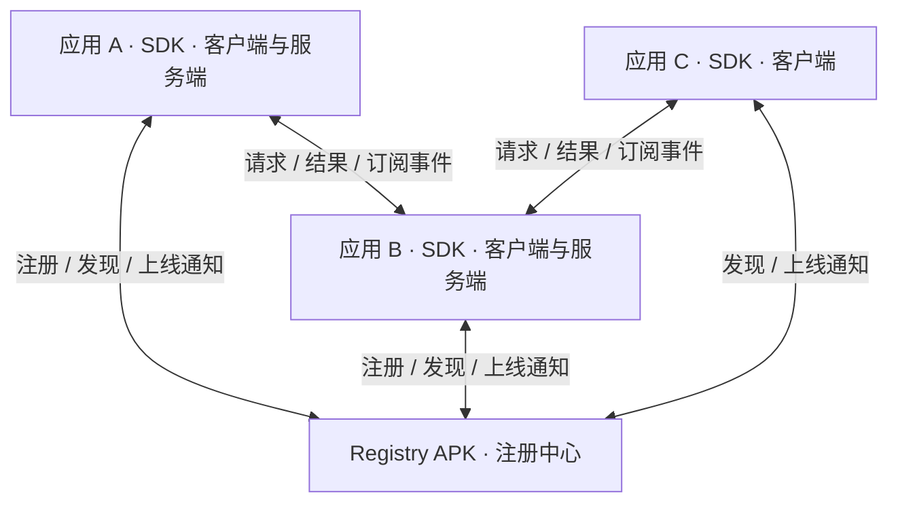
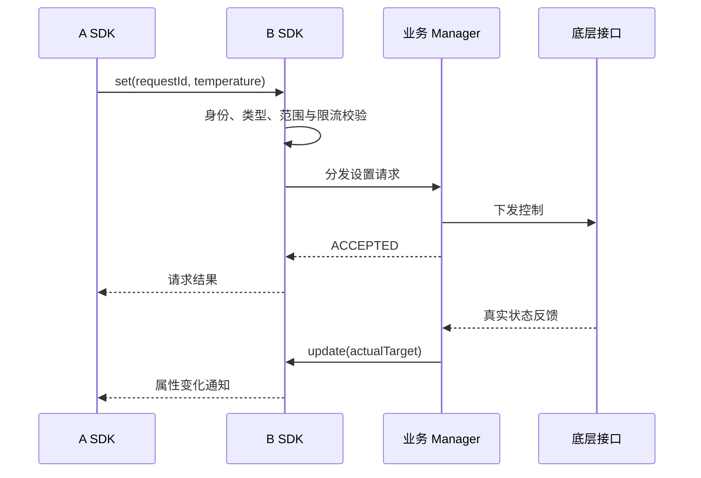
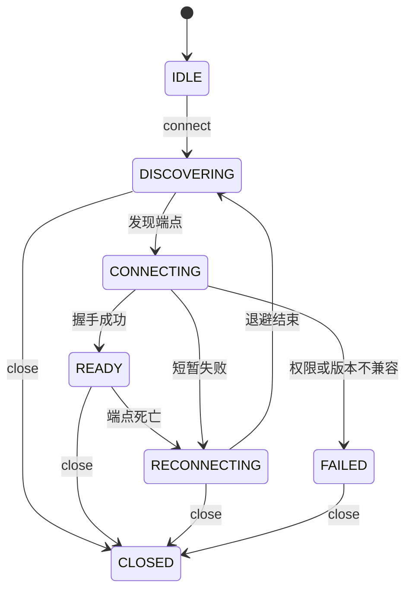

# Android 统一 IPC 中间件架构与实现规格

- 文档版本：1.3
- 编写日期：2026-09-07
- 状态：可供架构评审与开发实施的设计规格；不是已实现或已验证的软件
- 暂定项目名：CarIpc（可按团队规范统一重命名）
- 主要场景：Android 车机应用之间的能力调用、属性读写、状态和事件订阅
- 目标运行平台：Android 11 / 14 / 15；第一版 minSdk 30
- 读者：架构师、中间件开发者、业务接入开发者及负责实现的 AI 编程工具

> 本文中的 MUST / 必须表示验收要求，建议表示默认设计选择。示例 Kotlin DSL 和 AIDL 均为拟定接口规格，不是可直接运行的完整源代码。实现者应补齐类型、导入、序列化和构建配置，并提供真实跨进程验证结果。

## 本版修订与实施优先级

v1.3 新增：用户部署前置检查（3.5）、有界出站发送职责（11.1）、发现空快照与业务失效的区别（10.5）、可选 CAS 冲突快照（6.6）、稳定专属协议命名空间（15.4）。这些是实现约束，不增加新的首版业务功能。

v1.2 已补充：序列化按复杂度选型（7.5）、可选通知死区与限频（5.4）、注册中心单任务重连与分批恢复（10.5）。保持 P0/P1/P2 范围裁剪，不强制引入 Protobuf、高频信号框架或容灾平台。

此前 v1.1 已整合的规则继续有效：

| 变更 | 落点 | 交付要求 |
| --- | --- | --- |
| 同语义属性订阅聚合 | 9.6、14、17 | 按下述实施优先级执行 |
| 累积 ACK、延迟确认和窗口触发 | 9.4、11.3、17 | 按下述实施优先级执行 |
| 证书、权限与调用身份细化 | 12.4、17 | 按下述实施优先级执行 |
| 条件写与独立写版本 | 6.6、7、13、17 | 可选增强；首版不要求实现，明确需求后启用 |
| 操作关联与独立结果查询 | 6.7、7、13、17 | 可选增强；有可靠底层关联需求后实现 |

可选能力表示业务服务可以不提供；首版无需暴露尚未实现的扩展 API；若调用通用协议中的未知操作，应明确拒绝，不能静默执行普通写入。不得把条件写解释成硬件原子 CAS，也不得把关联 ID 本身解释成执行成功证据。

## 实施范围裁剪：避免过度设计（优先于后文完整设计）

本文保留演进设计供后续参考，但**不是要求一次性实现所有章节**。本节决定首版交付范围；后文标为“必须”的扩展内部规则，仅在该扩展被选择实施时适用。

默认场景：同一台车机、当前用户、少量受控应用、服务端已有常驻管理方式、小消息、普通低到中频属性更新。应用数量与消息频率是待测参数，不假定无限规模。场景若变化，再评估增强项。

| 层级 | 要实现什么 | 为什么 |
| --- | --- | --- |
| P0 首版必做 | 通用 AIDL、独立中心、Binder 直连、发布发现、get/set/call、多 Key 订阅 | 直接满足原始需求 |
| P0 首版必做 | 简单类型契约、错误码、异步调用、超时、取消订阅 | 降低业务接入成本 |
| P0 首版必做 | Binder 死亡清理、重新发布/发现/订阅、初始快照一致性 | 应用启动顺序和进程重启是现实问题 |
| P0 首版必做 | 可信中心、发布者所有权、真实 UID 与必要权限校验 | 防止误调用和错误服务接入；不要求通用策略平台 |
| P0 首版必做 | 状态合并、有界本地队列、发送限速、消息大小上限 | 防止常见泄漏、卡顿与突发堆积 |
| P1 按证据启用 | 相同属性订阅聚合 | 同一进程重复订阅明显且 Binder 通知有实际开销时 |
| P1 按证据启用 | ACK 窗口、延迟累计确认 | 高频推送或慢消费者测试表明简单限速不足时 |
| P1 按需求启用 | 条件写 | 业务确有多个写入者且需要拒绝过期修改时 |
| P1 按需求启用 | 操作结果关联 | UI 必须确认本次硬件操作完成且底层能提供证据时 |
| P1 按集成启用 | 不同签名厂商 ACL、证书轮换缓存、多用户、Direct Boot | 产品确实涉及这些条件时 |
| P2 暂不实现 | 持久操作结果、跨重启去重、可靠消息队列、复杂集合聚合 | 超出当前中间件目的 |

### 首版简化选择

- 普通属性写采用业务明确接受的“按服务端接收顺序下发”；不承诺物理完成顺序或最后用户意图获胜。单一控制者场景不引入 CAS。
- set 返回 ACCEPTED，UI 根据真实属性更新刷新。只有产品要求确认“本次动作”时才引入 OperationStore，普通温度/风量显示不强制需要它。
- 每个业务订阅保留独立远端句柄；没有实测重复订阅开销就不实现聚合器。
- 首版不实现 ACK。服务端状态队列按 Key 保留最新值、有界发送执行器并按业务约定频率限速，客户端使用有界队列。oneway 不是必达队列；此简化不承诺在冻结接收者或长期过载下有严格的远端在途界限。实际压测不满足目标时才升级为 9.4 的 ACK 方案，不能用“理论上应该没问题”代替验证。
- 普通事件限量发送，超出能力明确拒绝或报告丢失；必须可靠的事件不纳入首版保证。
- 内部 AIDL 可仅实现首版所需方法；acknowledge 和扩展操作属于演进接口示例，首版无需暴露空实现。正式发布前固定 transaction 编号并验证未来增量扩展。
- 模块先合并为 ipc-contract、ipc-sdk（含内部 protocol/runtime）、ipc-registry-app、业务 contract 和两个 sample。第 14 节是逻辑职责划分，不要求每个职责都成为 Gradle module 或独立类。
- 同厂商、同签名受控应用可以采用签名权限 + 小型发布/操作白名单。不要为了尚未存在的跨厂商场景建设动态证书策略引擎；真实调用 UID 和服务端操作授权仍保留。

### 如何判断一个机制是否现在需要

只有能回答“哪个实际业务需要、失败后有什么可观察影响、现有简单机制为何不足、如何复现并验收”，才把增强项加入首版。低概率不等于不可能，但也不应为每个理论场景构建完整系统。

交付先完成 P0 并记录实际负载与恢复结果；P1/P2 只记录触发条件，不生成空壳代码或无用抽象。

## 目录

1. 背景与目标
2. 范围与架构决策
3. 总体架构与部署
4. 服务身份与角色模型
5. 业务契约与能力模型
6. SDK 对外接口
7. 通用 AIDL 与线协议
8. 关键通信流程
9. 状态订阅与事件语义
10. 生命周期与自动恢复
11. 并发、超时和背压
12. 安全与多用户隔离
13. 缓存、版本兼容与异常
14. 工程模块与关键类
15. Android 接入与构建
16. 日志、诊断与性能
17. 测试与验收
18. 分阶段实施与交付
19. 给实现 AI 的执行提示词
20. 参考资料

## 1. 背景与目标

### 1.1 原始需求

应用 B 发布一个有唯一标识的服务。应用 A 通过标识连接 B，传入希望订阅的能力列表，由中间件自动完成 Binder 获取、回调注册、通知分发、取消订阅和断线恢复。A 还可以获取属性、设置属性和执行命令。

同一应用、同一进程内的不同业务模块都可以同时提供服务和消费服务。客户端、服务端是每一条通信关系中的角色，不是应用的互斥运行模式。

### 1.2 要解决的问题

- 业务开发者不熟悉 AIDL，重复编写 Stub、ServiceConnection 和回调管理容易出错。
- 应用之间各自设计通信协议，错误处理、线程规则和恢复行为不一致。
- 进程死亡、服务上线顺序、订阅泄漏、重复回调和版本错配难排查。
- 系统 UI、Launcher、空调、音频等模块希望使用统一的通信接口。

### 1.3 核心目标

1. 业务侧不编写 AIDL、不接触 Binder Stub / Proxy。
2. 按 serviceId 发布、发现和连接服务。
3. 支持 get / set / call / subscribe。
4. 自动管理连接、订阅生命周期和进程死亡恢复。
5. 提供强类型业务契约、运行期校验和统一错误模型。
6. 服务发现与业务传输分离，业务数据直接在两个进程之间传输。
7. 安全校验、资源上限和诊断能力属于正式能力，不是后补逻辑。

AIDL 仍然存在于 SDK 内部。客户端使用代理，服务端实现 Stub；隐藏 AIDL 不等于取消双方必须共同理解的业务协议。[Android AIDL](https://developer.android.com/develop/background-work/services/aidl)

## 2. 范围与架构决策

### 2.1 能力设计范围（交付优先级以开篇裁剪表为准）

| 能力 | 第一版要求 |
| --- | --- |
| 注册中心 | 独立 APK / 进程，动态注册与发现 |
| 业务传输 | Binder 直连，不经过中心转发 |
| 服务标识 | 用户范围内唯一，带发布者所有权 |
| 类型 | 强类型 Key + SDK 管理的线数据类型 |
| 调用 | 异步请求与结果回调，Kotlin 挂起封装、Java 回调封装 |
| 属性 | get、set、状态快照、变化订阅 |
| 事件 | 会话内有序、无持久化回放、明确丢失提示 |
| 恢复 | 端点死亡清理、重新发布、重新发现、重新订阅 |
| 订阅优化 | 相同语义属性订阅复用、本地独立句柄与有界分发 |
| ACK | 连续累计确认、延迟批量、窗口触发 |
| 可选扩展 | 条件写、操作状态跟踪，均通过能力协商启用 |
| 权限 | 注册中心和业务端点均校验调用者 |
| 示例 | 两个独立 APK；B 同时消费 A 的服务 |
| 兼容 | Android 11、14、15 实测矩阵 |

### 2.2 暂不承诺

- 不承诺进程永不被杀或任意后台启动成功。
- 不提供跨设备网络 RPC。
- 不提供持久消息队列、全局事务或 exactly-once 执行。
- 不通过反射调用任意方法，不支持任意 Java 对象透传。
- 不用 Binder 传输视频、完整图片或大文件正文。
- 第一版不建设注解处理器、KSP 编译插件或可视化管理平台。
- 不替代 VHAL、CarService 和底层车辆控制安全策略；中间件只是通信通道。

### 2.3 决策记录

| 决策 | 选择 | 原因 |
| --- | --- | --- |
| 服务发现 | 独立注册中心 | 每个 AAR 内的单例无法跨进程共享注册表 |
| 数据路径 | 客户端直连服务端 | 降低中心负载，已有连接不必依赖中心转发 |
| 订阅输入 | 属性 / 事件标识列表 | 避免绑定业务实现方法名和反射 |
| 业务类型 | 独立 contract 模块 | 在隐藏 AIDL 的同时保留可审查的协议 |
| 设置结果 | 区分 ACCEPTED / APPLIED | 请求接受与车辆实际反馈不是同一时刻 |
| 默认重试 | 只恢复连接和订阅 | 防止非幂等动作被重复执行 |
| 默认缓存 | 显式读取，标记有效性 | 不将过期值伪装为实时状态 |

## 3. 总体架构与部署



### 3.1 注册中心职责

保存服务描述、发布者 UID、端点 Binder、注册代次和死亡监听；校验谁能发布哪个标识；返回当前端点；通知服务上线、下线和替换。

注册中心不保存业务属性、不执行业务命令、不转发业务回调。记录仅驻留内存，进程重启后由服务端重新发布。不可持久化 Binder 对象来尝试恢复连接。

### 3.2 SDK 职责

封装通用 AIDL、协议编解码、类型校验、连接状态机、请求关联、超时管理、订阅管理、并发调度、权限适配、诊断数据和资源释放。

### 3.3 业务应用职责

提供契约、请求处理器、真实状态更新源和业务权限；明确服务发布与撤销的生命周期。空调服务仍须自己处理车辆条件、底层响应和功能可用性。

### 3.4 部署边界

优先使用独立注册中心，不把其逻辑直接加入 system_server，也不要求改 Framework 或使用隐藏 ServiceManager API。A/B 通过显式 ComponentName 绑定注册中心。

**直连 Binder 引用不等于 Android bindService 生命周期绑定。**本方案面向已有生命周期保障的服务提供者，A 获取 B 的端点不会自动建立 A 对 B Android Service 的绑定关系。如果未来支持按需拉起与保活关联，应增加显式 Provider Service 绑定适配器，并单独定义其权限、连接计数和启动失败处理。

### 3.5 集成前确认实际用户部署

开发接入前填写下表，依据目标车机实际进程和服务配置确认，不假设所有 APK 都在 User 0，也不把前台用户固定为 User 10。

| 对象 | 必须确认 |
| --- | --- |
| Registry | 运行用户、绑定组件、是否按用户部署实例 |
| 服务端 B | 实际运行用户、生命周期负责人、全车共享还是用户私有 |
| 客户端 A | 实际运行用户、用户切换后连接如何释放 |
| 通信范围 | A/B 是否同用户；跨用户时具备哪些产品授权 |

同用户部署继续采用现有 P0。若真实目标要求前台用户访问 User 0 服务，跨用户适配必须加入该产品的首版集成范围，而不是等上线后发现不可达。该要求不能泛化为所有项目都开发跨用户注册系统。

跨用户模式应显式配置服务作用域、目标用户、授权调用者及适用的平台绑定方式；不得“本用户查无服务就自动回退 User 0”。声明 crossUserVisible 不会自动授予系统权限，全局服务与用户私有服务也不能仅凭相同 serviceId 混用。

AAOS 支持 Headless System User 与普通用户分离，具体业务 APK 的部署仍须实测确认。[AAOS 多用户支持](https://source.android.com/docs/automotive/users_accounts/multi_user)

## 4. 服务身份与角色模型

### 4.1 唯一标识

```text
com.company.vehicle.climate
com.company.vehicle.audio
com.company.launcher.display
```

标识必须稳定、区分大小写、长度受限。第一版限制为 ASCII 小写字母、数字、点、下划线与短横线，总长度不超过 128 字节。

唯一性键为 `(userId, serviceId)`。第一版以当前 Android 用户内通信为边界，不默认允许跨用户。

### 4.2 服务描述

| 字段 | 含义 |
| --- | --- |
| serviceId | 稳定的逻辑服务名 |
| contractId | 业务契约名称 |
| contractMajor / contractMinor | 业务版本 |
| transportMajor / transportMinor | 通用传输协议版本 |
| instanceId | 本次发布的唯一实例 UUID |
| registryGeneration | 注册中心分配的条目代次 |
| capabilities | 属性、事件和命令的描述 |
| ownerUid / userId | 中心根据 Binder 调用身份生成，不信任请求值 |

### 4.3 所有权与重复注册

- 不同发布者不得抢占已存在的服务，也不得在服务离线期间抢占受保护标识。
- 中心使用预配置的 serviceId → 允许发布者签名 / 包身份规则校验，而非简单采用“先到先得”。
- 同一个活跃发布句柄重复 publish 应返回原句柄或明确错误，不生成双份记录。
- 替换必须显式执行且校验所有权，生成新的 instanceId / generation。
- 撤销和死亡清理必须同时比较 Binder 身份与 generation，避免旧进程死亡回调删掉新实例。
- 同一 UID 下的多个进程仍受唯一性约束，不能无条件覆盖。

## 5. 业务契约与能力模型

### 5.1 三类能力

| 类型 | 特点 | 示例 |
| --- | --- | --- |
| PropertyKey<T> | 有当前状态，可读、可选可写、可订阅 | 温度设定值、风量 |
| EventKey<T> | 某个时间发生的事件，没有默认当前值 | 自检完成、故障发生 |
| CommandKey<Req, Resp> | 带输入输出的一次动作 | 执行自检 |

不得把事件伪装成普通状态，也不得让任意字符串直接映射到业务反射方法。

### 5.2 契约示例

```kotlin
// API 设计示例：统一双端工厂方法，无需手写 AIDL
object ClimateContract {
    const val SERVICE_ID = "com.company.vehicle.climate"

    // 属性：目标温度，支持边界约束与死区限频过滤
    val TARGET_TEMPERATURE = PropertyKey.createFloat(
        id = "target_temperature",
        readable = true,
        writable = true,
        observable = true,
        unit = "celsius",
        min = 16.0f,
        max = 32.0f,
        notificationPolicy = NotificationPolicy(
            minDelta = 0.5,                  // 死区：数值变动 >= 0.5 才下发通知
            minNotificationIntervalMs = 50L  // 限频：通知间隔不低于 50ms
        )
    )

    // 属性：车内实测温度（只读）
    val CABIN_TEMPERATURE = PropertyKey.createFloat(
        id = "cabin_temperature",
        readable = true,
        writable = false,
        observable = true,
        unit = "celsius",
        min = -40.0f,
        max = 80.0f
    )

    // 属性：风速
    val FAN_SPEED = PropertyKey.createInt(
        id = "fan_speed",
        readable = true,
        writable = true,
        observable = true,
        min = 0,
        max = 7
    )

    // 复杂数据容器原生支持：Bundle 属性
    val CLIMATE_SETTINGS_BUNDLE = PropertyKey.createBundle<android.os.Bundle>(
        id = "climate_settings_bundle",
        readable = true,
        writable = true
    )

    // 单向事件广播
    val SELF_TEST_FINISHED = EventKey.createString("self_test_finished")

    // 双向 RPC 命令：自检命令
    val START_SELF_TEST = CommandKey.stringToString(
        id = "start_self_test",
        retryPolicy = RetryPolicy.NEVER
    )

    // 复杂 RPC 命令：入参和出参均为 Bundle
    val EXECUTE_PROFILE_CMD = CommandKey.bundleToBundle<android.os.Bundle, android.os.Bundle>(
        id = "execute_profile_cmd",
        retryPolicy = RetryPolicy.NEVER
    )

    // 聚合定义 ServiceSchema（支持链式构造）
    @JvmField
    val SCHEMA = ServiceSchema.builder(SERVICE_ID, major = 1, minor = 0)
        .addProperty(TARGET_TEMPERATURE)
        .addProperty(CABIN_TEMPERATURE)
        .addProperty(FAN_SPEED)
        .addProperty(CLIMATE_SETTINGS_BUNDLE)
        .addCommand(START_SELF_TEST)
        .addCommand(EXECUTE_PROFILE_CMD)
        .addEvent(SELF_TEST_FINISHED)
        .build()

    /** 兼容 Kotlin 习惯的小写访问器 */
    val schema: ServiceSchema get() = SCHEMA
}
```

此处温度是“车辆反馈的目标温度设定值”，不是车内实测温度。实际项目必须在契约中区分 `target_temperature` 与 `cabin_temperature`。

### 5.3 类型与校验

首版按业务需要支持 Boolean、Int、Long、Float、Double、String 和受限 byte[]；有界列表及复杂记录仅在实际需要时加入，编码选型遵循 7.5，禁止自研通用嵌套记录协议。显式表达 null；禁止用 null 混合表示未初始化、无权限和服务下线。

泛型 Key 提供编译期约束，服务端仍必须验证线类型、范围、长度、枚举值和可写性。浮点属性还应拒绝不被契约允许的 NaN / Infinity。

contract 模块包含 Key、schema、DTO 和 codec，不含 Binder、业务实现、Activity 或 Application。新增能力通常只更新相关业务契约，不改通用 AIDL。

### 5.4 可选属性通知元数据：死区与限频

仅适用于普通连续数值状态，默认关闭，不改变底层采样频率，不适用于故障、告警、操作完成等事件。该配置为 P1 按业务启用；不建立独立信号处理框架。

| 字段 | 语义 | 默认 |
| --- | --- | --- |
| minNotificationIntervalMs | 普通变化通知最小间隔，单调时钟计时 | 0（不额外限频） |
| minDelta | 相对上次已发出通知值的绝对变化阈值，单位与属性一致 | 0（不额外死区） |

例如温度阈值 0.5 表示 0.5℃，不是百分比。配置必须为有限非负值，minDelta 仅对数值属性有效。

**先更新真实 StateStore，再决定是否产生通知。**24.0℃ 已通知，底层更新到 24.2℃ 时，即使 minDelta=0.5 不通知，get 也必须返回 24.2℃ 及最新版本。过滤不能让权威状态永久停留在旧值。

实现规则：

1. 每次有效 update 先按既有规则更新状态与质量；死区在通知入队前判断，不删除真实状态。
2. 数值与上次通知值比较，达到阈值（差值 >= minDelta）才有通知资格，不能与上一采样值比较，否则连续小变化可能永远不通知。
3. 达到变化阈值但仍处于限频窗口时，保留最新候选，到期重新以最新状态判断并发送；不得因为更新停止就丢掉最后一个合格变化。
4. 同时启用两项时，以最新值重新检查死区。若到期已回到死区内，可以不发送；“保留最后值”不代表绕过死区必发。
5. 初始订阅快照及 VALID/UNAVAILABLE 等质量变化绕过普通过滤；重连初始化重新建立通知基线。
6. 基线在消息进入既有有序发送路径时推进，不在每次 update 时推进，也不依赖业务 listener 执行完成。通知策略是服务/属性级默认策略，首版不增加每客户端自定义采样协商。
7. 定时任务随属性/服务关闭释放，不创建每次 update 一个新线程。状态更新和定时到期在同一控制执行器处理，避免快照与通知竞争。

示例（仅在启用该能力后提供）：

```kotlin
notificationPolicy = NotificationPolicy(
    minNotificationIntervalMs = 100,
    minDelta = 0.5
)
```

降低的是通知与发送队列开销，不保证完全消除 update 的 CPU 成本。只有压测发现入口更新本身过载时，才评估入队前合并；不能直接跳过所有中间状态，因为业务可能依赖阈值越界或质量变化。

## 6. SDK 对外接口

### 6.1 API 一览

| API | 语义 |
| --- | --- |
| CarIpc.create(context, config) | 创建当前进程 SDK 实例，持有 Application Context |
| publishService(id, schema, handlers) | 创建发布句柄，异步完成注册 |
| connect(serviceId, options) | 返回逻辑连接，后台等待和连接 |
| awaitReady(timeout) | 等待握手和能力校验完成 |
| get(key) | 读取服务端权威状态存储中的最新已知快照 |
| getCached(key) | 显式读取客户端缓存，返回新鲜度 |
| set(key, value) | 请求修改属性 |
| setIfVersion(key, value, token) | 可选：按属性写版本原子接受请求 |
| getOperation(operationId) | 可选：查询操作的最新结果 |
| awaitOperation(operationId, timeout) | 可选：等待关联操作，超时不等于取消 |
| call(command, request) | 执行声明过的命令 |
| subscribe(keys, options, listener) | 创建属性 / 事件订阅 |
| update(key, value) | 服务端发布真实确认的属性状态 |
| emit(eventKey, payload) | 服务端发布一次事件 |
| close() | 幂等释放自身拥有的资源 |

网络式阻塞 API 不作为主入口；Kotlin 使用 suspend，Java 使用异步 callback + CancelHandle。Java 调用者不必依赖 Kotlin DSL。

### 6.2 发布服务示例

```kotlin
val ipc = CarIpc.create(applicationContext, ipcConfig)

val service = ipc.publishService(
    serviceId = ClimateContract.SERVICE_ID,
    schema = ClimateContract.SCHEMA
) {
    onSet(ClimateContract.TARGET_TEMPERATURE) { value, caller ->
        climateManager.checkControlAllowed(caller)
        climateManager.requestTargetTemperature(value)
        SetReceipt.accepted()
    }
    onCall(ClimateContract.START_SELF_TEST) { _, caller ->
        climateManager.startSelfTest(caller)
    }
}

// 注册真实底层监听，首次读取和后续变化都进入同一状态存储。
climateManager.onTargetTemperatureChanged { actualTarget ->
    service.update(ClimateContract.TARGET_TEMPERATURE, actualTarget)
}

// 清理时先移除业务监听，再 close 发布句柄，避免持有过期句柄。
```

为使 get 与订阅快照一致，第一版的属性读取统一来自服务端 StateStore。业务层在初始化和底层回调时调用 update；未初始化属性返回 UNINITIALIZED。需要主动查询硬件的行为应定义成命令，不能让 onGet 临时返回一个未进入 StateStore 的值。

### 6.3 客户端示例

```kotlin
val climate = ipc.connect(ClimateContract.SERVICE_ID)

// 在生命周期管理的协程中执行。
climate.awaitReady(timeoutMillis = 5_000)

val subscription = climate.subscribe(
    keys = listOf(
        ClimateContract.TARGET_TEMPERATURE,
        ClimateContract.FAN_SPEED
    ),
    options = SubscribeOptions(replayLatest = true),
    callbackExecutor = mainExecutor
) { message ->
    when (message) {
        is PropertyUpdate -> render(message)
        is SubscriptionError -> showConnectionIssue(message.error)
        else -> Unit
    }
}

val snapshot = climate.get(ClimateContract.TARGET_TEMPERATURE)
val receipt = climate.set(ClimateContract.TARGET_TEMPERATURE, 24.0f)

// 业务结束时：
subscription.close()
climate.close()
```

混合类型列表的回调返回带 Key / 类型标签的消息，使用 `message.valueFor(key)` 之类的安全访问函数；不得要求业务使用无检查的 `as T`。

### 6.4 Java 适配示例

```java
RemoteService climate = ipc.connect(ClimateContract.SERVICE_ID);
CancelHandle handle = climate.setAsync(
    ClimateContract.TARGET_TEMPERATURE,
    24.0f,
    mainExecutor,
    new ResultCallback<SetReceipt>() {
        @Override public void onSuccess(SetReceipt receipt) { }
        @Override public void onError(IpcError error) { }
    }
);
```

### 6.5 set 与完成语义

- ACCEPTED：校验通过，业务层接受了请求，不代表物理操作完成。
- APPLIED：仅当业务实现获得明确执行证据时返回。
- REJECTED：请求未被接受，携带错误码。
- TIMEOUT / CONNECTION_LOST：完成情况可能未知，禁止直接推断操作失败且未执行。

长任务返回 operationId，后续通过专用查询 / 事件确认。`setAndAwait` 必须建立在 6.7 的操作结果跟踪之上。仅以“值相等”无法证明本次请求导致了变化；缺乏底层完成证据时只能返回状态观测结果或 UNKNOWN，不能报告关联操作已 APPLIED。

### 6.6 可选条件写：写版本与状态版本分离

**目的：拒绝基于过期写入上下文的控制请求，不承诺硬件执行原子性或跨客户端最后意图获胜。**

仅使用真实反馈后才更新的 stateRevision 不够：A 与 B 都读取版本 10；A 的写请求已接受但硬件未反馈时，B 仍可拿版本 10 通过检查。因此单纯 `set(..., expectedStateRevision)` 无法关闭这个窗口。

| 字段 | 作用 |
| --- | --- |
| stateRevision | 现有服务状态 revision；真实状态或质量更新时推进 |
| propertyWriteRevision | 属性级写入协调版本；预占/接受写入时推进 |
| WriteToken | serviceInstanceId + capabilityId + propertyWriteRevision |

支持条件写的属性快照返回 WriteToken。所有普通 set 与条件 set 都必须经过同一写入协调器，普通 set 也推进写版本，否则普通请求可绕过冲突检测。

处理步骤：

1. 校验身份、能力、值及 WriteToken 对应的服务实例与属性。
2. 在该属性的串行临界区比较 propertyWriteRevision。
3. 不相等返回 CONCURRENT_CONFLICT；相等时原子预占、分配 operationId（如支持跟踪）并推进写版本。
4. 释放内部锁后执行耗时业务。预占之后下发失败，记录失败但不回退写版本，避免旧令牌再次有效。
5. 返回新 WriteToken；实际状态仍等待 StateStore 的真实更新，不能为了推进写版本伪造属性值变化。

写版本变化可通过 get 获取；不得把它当成真实属性变化广播。外部控制来源的真实状态变化也应使旧 WriteToken 失效，建议每次有效值或质量变化都推进对应写版本；这可能保守地产生冲突，但规则简单且可验证。

```kotlin
val snapshot = climate.get(ClimateContract.TARGET_TEMPERATURE)
val receipt = climate.setIfVersion(
    ClimateContract.TARGET_TEMPERATURE,
    24.0f,
    snapshot.writeToken // 能力不支持时不提供
)
```

启用条件写时，CONCURRENT_CONFLICT 响应可附带 currentWriteToken；调用者同时有该属性读取权限时，可附带 currentSnapshot。快照和令牌在同一属性协调一致性点读取，不泄露无读取权限的属性值；无权限或数据不可用时明确省略。错误封套中这些字段为可选，旧端无需支持。

附带数据只表示生成冲突响应时的状态，收到响应后仍可能变化。客户端可据此重新判断，缺少数据且有权限时再 get；不得因此自动重试或承诺下一次成功。不引入跨请求锁或事务。

冲突后由业务重新判断，不自动无限重试。实例不匹配返回 STALE_INSTANCE。属性级版本避免风量变化导致温度写入冲突；同值写入也推进写版本，防止 ABA 式旧上下文复用。

这是一种中间件“请求接受/预占”的 CAS。外部硬件变化仍可能发生在校验与实际执行之间；若要求“只有硬件当前值为 X 才改成 Y”，必须由底层提供原子条件执行。UI 最新请求优先、旧请求淘汰、多调用者优先级和底层完成顺序是另外的业务调度规则。

### 6.7 可选操作跟踪：独立结果与可靠关联

| 标识 | 责任 |
| --- | --- |
| requestId | 一次 IPC 请求及其响应 |
| operationId | 服务端生成的逻辑操作标识，在服务实例范围内唯一 |
| clientCorrelationId | 客户端可选业务标记，服务端按 UID/客户端实例隔离；不是鉴权凭据 |
| hardwareTransactionId | 底层支持时用于映射实际执行反馈 |

服务端保存 `ownerUid + serviceInstanceId + operationId` 及请求到硬件事务的映射。操作状态为 ACCEPTED、EXECUTING、APPLIED、FAILED；无法确认时返回 UNKNOWN。确认取消才可返回 CANCELLED，发送取消请求不等于取消成功。

- APPLIED 必须依据业务契约规定的完成证据。底层回显事务编号或接收 ACK 不能直接等同于执行成功。
- `update` 可携带可选 causeOperationId；无法唯一归因时省略，不依据值相等推断原因。
- 独立 OperationStore 保存操作结果；getOperation 和 awaitOperation 不依赖属性是否变化。
- 已经为 24℃时再次设置 24℃，属性可不通知，但操作结果仍能独立完成。
- 操作结果不进入会合并丢弃的属性队列。第一版 awaitOperation 使用有界次数的查询等待，避免新增无限结果事件流；如后续增加推送，必须独立队列并保留查询恢复路径。
- 查询只允许操作所有者 UID 或明确授权的诊断主体，不能凭猜到 operationId 读取结果。
- 建议每 UID 最多 256 个保留操作，终态保留 5 分钟；活跃操作有执行期限，超期转为 UNKNOWN 后才进入回收策略。资源满时拒绝新操作，不静默删除活跃记录。
- 结果过期返回 OPERATION_EXPIRED，服务重启后的旧实例返回 STALE_INSTANCE 或明确的 UNKNOWN，不推断未执行。
- 第一版 OperationStore 为内存存储；不承诺跨重启恢复。需要持久结果与审计的产品另行扩展。

```kotlin
val receipt = climate.set(ClimateContract.TARGET_TEMPERATURE, 24.0f)
val operation = climate.awaitOperation(receipt.operationId, timeoutMillis = 5_000)
// 只有明确 APPLIED 才展示“本次操作已确认完成”。
```

不支持操作跟踪的服务可以正常 set 并返回 ACCEPTED，但 awaitOperation / setAndAwait 明确返回 CAPABILITY_NOT_SUPPORTED。UI 可显示“请求已发送”并观察当前状态，不能伪装为已确认本次操作生效。

## 7. 通用 AIDL 与线协议

### 7.1 内部接口族

| 接口 | 责任 |
| --- | --- |
| IRegistry | 发布、撤销、发现并监听服务 |
| IRegistryCallback | 注册结果、当前快照和服务变化 |
| IEndpoint | 协议握手并建立客户端会话 |
| ISession | 会话内请求、订阅、取消和关闭 |
| IClientCallback | 握手结果、请求结果、属性事件、错误 |

Binder 支持把其他接口对象作为参数传递，因此中心能够返回服务端点，服务端也能返回专属会话接口。[AOSP AIDL 语言](https://source.android.com/docs/core/architecture/aidl/aidl-language)

### 7.2 AIDL 形态示例

以下省略 package、import 及 Parcelable 声明，每个 interface 应放到独立文件。所有 one-way 方法的业务结果通过 callback 返回。

```aidl
interface IRegistry {
    oneway void publish(in ServiceDescriptor descriptor,
        IEndpoint endpoint, IRegistryCallback callback);
    oneway void unpublish(in RegistrationToken token);
    oneway void resolveAndWatch(String serviceId, long watchId,
        IRegistryCallback callback);
    oneway void unwatch(long watchId, IRegistryCallback callback);
}

interface IEndpoint {
    oneway void openSession(in ClientHello hello,
        IClientCallback callback);
}

interface ISession {
    oneway void request(in RequestEnvelope request);
    oneway void subscribe(in SubscribeRequest request);
    oneway void unsubscribe(String subscriptionId);
    oneway void acknowledge(String subscriptionId, long deliverySeq);
    oneway void cancel(String requestId);
    oneway void close();
}

interface IClientCallback {
    oneway void onSessionOpened(in ServerHello hello, ISession session);
    oneway void onSessionRejected(in ErrorEnvelope error);
    oneway void onResult(in ResponseEnvelope response);
    oneway void onSubscriptionMessage(in SubscriptionMessage message);
}
```

RegistryCallback 必须定义：发布成功 token、发布失败、初始发现快照、携带 watchId 与 generation 的上线 / 下线变化以及监听错误。不存在的端点用独立“不可用”消息表达，不传未标记 nullable 的 null Binder。

### 7.3 会话约束

openSession 入口捕获并验证真实 callingUid，建立 `(ownerUid, clientInstanceId, sessionId)` 绑定。ISession 的每个入口都验证 callingUid 与会话所有者一致；即使 Binder 被转交，也不能被另一 UID 使用。

同 UID 内不能依靠 Binder UID 区分互不可信应用；使用 shared UID 就必须接受该安全边界，不能依靠自报包名假装隔离。

### 7.4 请求与响应字段

| 结构 | 必需字段 |
| --- | --- |
| ClientHello | transport 版本范围、contract 版本范围、clientInstanceId、openRequestId |
| ServerHello | 协商版本、serviceInstanceId、sessionId、能力描述、限额 |
| RequestEnvelope | requestId、operation、capabilityId、payload、deadlineElapsedMs；可选 expectedWriteToken、clientCorrelationId |
| ResponseEnvelope | requestId、serviceInstanceId、status、payload 或 error；可选 operationId、writeToken |
| SubscribeRequest | subscriptionId、keys、replayLatest、请求选项 |
| SubscriptionMessage | subscriptionId、serviceInstanceId、kind、deliverySeq、revision、payload；可选 causeOperationId |
| RegistrationToken | serviceId、instanceId、generation、不可猜测 token |

deadline 使用同设备 `SystemClock.elapsedRealtime()` 基准，服务端将客户端值限制在允许的最大等待范围。不能使用可被校时改变的墙上时间计算请求超时。

请求 operation 扩展 SET_IF_VERSION 和 GET_OPERATION；沿用 ISession.request，不新增专用 AIDL 方法。schema 为每个属性声明 supportsConditionalWrite、supportsOperationTracking 及完成证据语义；旧端不认识扩展时返回 CAPABILITY_NOT_SUPPORTED，不静默降级为普通 set。

### 7.5 序列化选型与协议冻结

**不在首版自研通用的字段编号、递归对象与未知字段跳过编码框架，也不安排“先做复杂手写协议、P1 再整体替换”的重复工作。**

| 实际载荷 | 选择 |
| --- | --- |
| 简单属性与少量固定结构 | SDK 内部固定 Parcelable 封套、有限类型标签及基础值；只实现用到的类型 |
| 确定需要嵌套 DTO、多团队独立升级 | 在开发载荷 codec 前评估并选定 Protobuf Lite |
| 尚无复杂 DTO 需求 | 保留 codec 边界，不强制引入 Protobuf 或占位实现 |

简单方案不是“支持任意对象”的编码引擎；未知类型明确拒绝，固定布局变更通过协议版本判断，不能宣称能自动跳过任意新增字段。业务不透传 Serializable 或任意业务 Parcelable。

若选用 Protobuf Lite：外层 RequestEnvelope / ResponseEnvelope 继续承载路由、身份关联、截止时间等；载荷使用序列化后的 byte[]，不直接将 ByteString 对象跨 Binder 传递。协议中明确 codecId、schemaId 与版本，不尝试自动猜测编码；公共契约 DTO 可通过生成代码适配，但不向业务暴露内部 Binder 封套。SDK 发布预生成代码与运行期依赖，避免要求每个消费工程自行安装生成插件。

Protobuf 提供字段编号与未知字段处理，但不是任意变更都兼容：禁止复用字段编号，删除字段保留编号，避免改变已有字段类型，并对缺省值、字段存在性和枚举未知值制定规则。[Protobuf 官方最佳实践](https://protobuf.dev/best-practices/dos-donts/)

所有方案都限制载荷大小、数组/列表长度，验证业务范围并拒绝损坏数据；若启用嵌套结构，再配置解析深度与适用的资源限制。Protobuf 不取消外层 Parcelable 的兼容责任。固定封套保持稳定，读取前检查协商版本；需要扩展封套布局时采用经过验证的边界格式或升级协议，不仅加一个 version 字段就声称兼容。

一旦正式发布，冻结已有 AIDL 方法签名和 transaction 编号。更换 codec 必须显式协商，覆盖新旧客户端/服务端组合；没有需求就不实现双 codec 自动迁移。普通 Gradle AIDL 不等同于 AOSP Stable AIDL 自动兼容校验。

## 8. 关键通信流程

### 8.1 发布与连接

1. B 创建 SDK 并显式绑定注册中心。
2. B 创建端点并发布 schema。
3. 中心捕获 UID，验证发布所有权，登记死亡监听。
4. 中心在串行注册表执行器中写入记录，返回 token 并通知观察者。
5. A 调用 connect，SDK 执行 resolveAndWatch。
6. 中心原子地建立监听并返回当前快照，避免“先查询后监听”漏上线。
7. A 检查 endpoint 并发起 openSession；B 校验 A、协商版本和能力。
8. A 获得 ISession 后进入 READY，再恢复订阅。

### 8.2 调用与真实反馈



底层反馈可能早于 ACCEPTED 响应到达客户端，SDK 不应依赖它们的到达先后判断结果。

### 8.3 撤销

发布句柄 close 后先把本地端点标记不可用，关闭会话，再向中心撤销。中心只删除与 token / generation 一致的条目。中心不可达时，本地仍须拒绝新请求；恢复连接后清理旧注册或以当前发布意图重新同步。

## 9. 状态订阅与事件语义

### 9.1 属性状态

每条属性快照包含：value（如有效）、quality、revision、sourceElapsedMs、serviceInstanceId。quality 至少包括 VALID、UNINITIALIZED、UNAVAILABLE、STALE。时间表示业务采样或接收时间，不等于调用 get 的时间。

StateStore 由每服务串行执行器管理；update 校验后更新值并增加服务内 revision，再产生订阅消息。相同值默认不产生变化通知，质量变化必须通知；浮点比较策略由契约明确。

### 9.2 初始快照的原子性

subscribe 命令与 update 在同一串行调度上下文执行：

1. 校验所有 keys，第一版任一 key 无效则整体失败，不做静默部分订阅。
2. 建立 subscriptionId 对应的订阅记录。
3. 读取 revision R 对应的所有属性快照。
4. 将 SUBSCRIBED 和初始快照排入该订阅有序发送队列。
5. 后续变化以更高 revision 排在快照之后。

快照可以分多个消息，但必须包含 snapshotId、分片序号和 SNAPSHOT_END；客户端收齐后才对外标记初始化完成。第一版限制快照总大小，超限则明确拒绝，不截断。

### 9.3 状态与事件区别

| 项目 | 属性 | 事件 |
| --- | --- | --- |
| 首次订阅 | 可回放当前快照 | 默认只接收订阅生效后的事件 |
| 慢消费者 | 同一 Key 的待发送值可合并 | 不静默合并 |
| 断线期间 | 重连后重新取快照 | 第一版可能丢失，无持久补发 |
| 序号 | revision 跳跃可能是合法状态合并 | 用订阅 deliverySeq / 显式 GAP 表达交付缺口 |
| 可靠要求 | 最新状态最终同步 | 审计类可靠事件需另建持久日志能力 |

revision 是服务状态版本，不保证对每个订阅连续。客户端不得仅因订阅未关注属性产生的 revision 跳号就报告丢包。

### 9.4 可选增强：ACK 背压协议

每个远端订阅维护有界待发队列与在途窗口。客户端将消息安全接入本地有界分发机制后，记录可确认的最高连续 deliverySeq，采用累计 ACK；它不表示所有业务 listener 已执行完，也不是持久交付证明。窗口耗尽时停止向 Binder 灌入通知。

启用 ACK 扩展后，调度必须实现以下任一条件触发：累计新增消息达到批量阈值；从第一条未确认消息起达到延迟上限；或未确认数量接近协商窗口上限。默认批量阈值为 min(5, windowSize)，最大延迟 20ms，窗口压力阈值为 max(1, windowSize - 1)，均为压测起点。

定时器只在存在未确认消息时运行；延迟是调度目标，不是实时保证。重连/关闭时取消旧定时器，禁止向新订阅提交旧 ACK。ACK 序号属于某个 session + subscription；序号在消息实际进入发送顺序时分配，状态合并不得制造未发送的序号空洞。

服务端忽略重复/旧 ACK，拒绝大于已发送最高序号的 ACK。客户端乱序完成本地接收时，不能跳过尚未安全接收的序号。不要用 stateRevision 替代 deliverySeq。

批量 5 条确认可使该批 ACK 次数从 5 降至 1，但通知加 ACK 的总调用从 10 降至 6；实际收益取决于频率、窗口和定时器，不承诺固定降低 80%。

- 属性：合并尚未发送的同 Key 更新，保留最新状态；初始快照和控制消息不可被合并掉。
- 事件：待发队列满时终止该订阅并保留终止原因，在可用控制通道发送 GAP / SLOW_CONSUMER；客户端也通过 watchdog 感知停滞。
- 不把 oneway 当成无限容量、必达的消息队列。
- 第一版不保证回调业务完成的持久确认；ACK 只是流控，不是 exactly-once 保证。

### 9.5 订阅去重与取消

同一 session 内 subscriptionId 唯一，重复完全相同的请求幂等返回当前状态，参数冲突返回错误。不同业务监听器即使订阅相同 keys 也有各自句柄。

close 为幂等操作。客户端关闭时立即取消本地投递并递增回调代次；已排队的旧回调执行前检查代次。close 返回后不得再开始新的业务回调，已经执行中的回调允许完成，避免自关闭死锁。

### 9.6 可选增强：客户端属性订阅聚合

业务句柄和远端订阅是两层对象。每个本地监听器保留自己的 LocalSubscription；SDK 的 SubscriptionAggregator 在语义相同时复用 RemoteSubscription，再进行本地扇出。

**启用聚合后的条件：**相同 SDK 实例、相同服务实例和安全会话、相同规范化属性 Key 集合，以及相同过滤/采样/交付选项。callbackExecutor 不必相同，由各本地句柄分别调度。混合事件订阅、不同 Key 集合或不同选项第一版不自动合并；不为仅部分重叠的集合做动态拆分，以保留多 Key 快照一致性。

| 情况 | 行为 |
| --- | --- |
| 首个兼容 listener 加入 | 创建远端订阅和引用计数 |
| 后续兼容 listener 加入 | 复用远端订阅，本地独立回调 |
| 一个 listener 关闭 | 仅移除本地句柄 |
| 最后一个 listener 关闭 | 取消远端订阅，释放缓存与队列 |
| 服务实例变化 | 废弃旧远端句柄，保留有效本地意图，恢复新订阅 |

本地聚合器在串行分发上下文原子完成“加入 listener + 获取当前完整快照 + 排入其初始化消息”，随后再排入增量。远端初始快照未结束时，新 listener 等待初始化完成；缓存 STALE 时不能把旧值作为新会话有效快照。每个 listener 各有本地代次，关闭后的旧任务执行前必须检查。

每个 listener 使用独立有界队列；状态更新可按 Key 合并，初始快照与控制消息不能丢弃。建议每个 listener 上限 128 条消息，并同时设总字节预算；放不下初始快照时明确失败。慢 listener 只影响自身，不阻塞其他 listener 或无限推迟共享远端 ACK。

聚合不会跨 UID 提升权限，也不跨不同会话强行复用；“每进程共享”以应用实际复用同一个 CarIpc 实例为前提。应用创建多个独立 SDK 实例时不承诺自动全局合并。

## 10. 生命周期与自动恢复

### 10.1 连接状态机



awaitReady 的超时只结束本次等待；逻辑连接是否持续重试由 options 控制，默认持续到 close。权限拒绝和主版本不兼容不进行紧密重试。

### 10.2 故障处理表

| 场景 | 必须行为 |
| --- | --- |
| A 先启动，B 未发布 | 保持等待；单次请求按 deadline 失败 |
| B 崩溃 | A 标记连接丢失、缓存过期，未决写请求完成状态未知 |
| B 重启 | B 自动发布；A 创建新会话和新订阅，接收新快照 |
| A 崩溃 | B 按 callback Binder 死亡清理会话、队列与订阅 |
| 中心重启 | B 重新发布；A 重建发现监听；存活直连继续工作 |
| 中心离线期间 B 重启 | 新发现等待中心恢复，不凭旧 Binder 假装可用 |
| B 发布新实例替换旧实例 | A 按 generation 切换；旧实例消息丢弃 |
| 应用更新导致绑定死亡 | 释放旧绑定并重新绑定 |
| 权限撤销 | 后续请求拒绝，已有订阅按策略关闭 |
| 用户切换 | 关闭旧用户上下文连接和缓存，不跨用户复用 |

Android 的 onBindingDied 表示该绑定不能再正常连接，需要解绑后重新绑定；onServiceDisconnected 与之语义不同，不能统一当成永久失效。[ServiceConnection](https://developer.android.com/reference/android/content/ServiceConnection)

### 10.3 重试与幂等

建议退避为 200ms 起、指数增长、上限 10s，并加入随机抖动；参数可配置。连接恢复不代表业务请求恢复。

- get 可在 deadline 内最多重试一次可恢复传输失败。
- set / call 默认不自动重放，包括服务重启后。
- 明确声明幂等的命令可选 requestId 去重，缓存键至少含 UID、客户端实例、requestId、请求摘要。
- 去重缓存需要 TTL 和上限；同 requestId 不同参数返回冲突。
- 内存去重在服务重启后丢失，不能承诺跨重启 exactly-once。
- cancel 是尽力取消，不能回滚已发生的底层操作。

### 10.4 Android 生命周期说明

中间件注册不提供保活。采用 Started / Bound Service 或 OEM 系统管理方式时，应遵守对应系统版本和产品配置的生命周期规则。[Android Services](https://developer.android.com/develop/background-work/services)

Application.onTerminate 在真实设备不能用作可靠清理入口；常驻模块显式控制启动与停止，死亡时依赖 Binder 清理。UI 订阅随页面生命周期释放，不让 SDK 持有 Activity。

### 10.5 Registry 连接恢复的最小强化

本节细化已有重连机制，不提供进程保活保证，也不新增去中心化注册系统。

- 一个 CarIpc 实例只维护一个 RegistryConnector、一个绑定状态机和一个待执行重连任务；各业务服务共享它，不能各自开启循环。
- SDK 监听 Registry Binder 死亡，中心监听发布端点和发现观察者 callback 死亡。二者用于故障检测与清理，不意味着自动拉起必然成功。
- Registry 失效只清理发现通道状态，存活的 A/B Session 保持使用。端点死亡、权限失效和业务 close 分别处理，不混为中心死亡。
- 首次绑定可立即尝试。失败后使用 10.3 的有上限指数退避与随机抖动；重连成功后的恢复提交也可短暂打散。不依赖多应用同一固定延迟。
- 绑定恢复后，按小批量处理当前仍有效的发布意图和监听意图（建议每批 8 项作为起点），批次间让出执行器；不需要分布式限流器。
- 意图以本地句柄去重，已关闭项不得重新发布；每次连接代次只发起一份恢复任务。迟到响应与旧代次回调丢弃，避免重复 watch 或旧 token 覆盖新状态。
- 仅 Registry 重连且业务端点仍活跃时，保持服务 instanceId 稳定；registryGeneration 只在所属 Registry 实例范围内解释，通过当前连接代次区分重启后的编号，不能跨中心实例比较大小。
- 服务端继续用已有端点重新登记；客户端发现同一有效端点时不无故重建 Session。实际端点/实例变化才切换会话并恢复订阅。

**初始空快照规则：**Registry 重启后 A 可能先于 B 恢复，resolveAndWatch 暂时返回不存在。该结果只更新“当前发现不可用”，不能销毁此前仍健康的直连 Session。发现状态与业务连接状态分别保存，不让一个 AVAILABLE 布尔值同时决定两者。

“发现缺失不误断”也不等于只在 binderDied 时关闭。主动撤销/会话关闭、权限失效、端点实例替换、明确的连接级传输失败都按对应规则终止或重建会话。普通单次业务错误或单次等待超时不自动当成端点死亡。中心的空快照不是经确认的业务撤销指令。

数十个轻量注册请求不应直接被假定为故障；先验证去重、串行恢复和有限突发负载。只有存在测量证据才进一步调整批量与限速参数。

## 11. 并发、超时和背压

### 11.1 线程划分

| 执行上下文 | 责任 |
| --- | --- |
| Binder 入口 | 捕获身份、轻量校验、投递队列，尽快返回 |
| Registry executor | 注册表与监听变更的串行处理 |
| 每服务控制 executor | StateStore、订阅建立、revision 分配 |
| 业务 executor | 执行可能耗时的 handler，可按服务配置并发 |
| 客户端 callback executor | 调用业务监听，默认串行后台执行器 |
| 定时调度器 | deadline、重连和慢消费者检测 |
| 有界出站执行器 | 提交业务 Binder 请求和通知；启用 ACK 时也承载 ACK |

远程 AIDL 调用会进入 Binder 线程池，而同进程调用可能直接在调用线程执行；因此同进程路径也必须显式调度。禁止持有内部锁时调用远端或业务 listener。[AIDL 线程规则](https://developer.android.com/develop/background-work/services/aidl)

**出站发送约束：**业务请求、通知及可选 ACK 经 SDK 管理的有界发送执行器调度；Binder 入口、StateStore 控制执行器和 UI 线程不直接承担可能耗时的业务发送。先在内部锁下完成状态修改并取出不可变任务，再释放锁并提交发送，任何锁内都不调用远端或 listener。

复用固定上限线程池并按会话维护必要的顺序队列，不为每个客户端无限创建专属线程，也不让一个全局单线程成为所有服务唯一出站通道。队列满时按现有状态合并/拒绝规则处理，不阻塞状态控制线程；发送失败记录并进入对应错误路径。线程池隔离不能保证异常系统调用可被强制取消，不使用无限补线程作为恢复手段。

oneway 不表示没有发送成本或无限缓冲；对冻结接收者持续发送可能产生资源耗尽或失败。不能将“缓冲满必然产生双方内核永久死锁”作为已证实的通用前提。限速、有界队列与真实负载验证仍需保留。[AOSP Binder 冻结处理](https://source.android.com/docs/core/architecture/ipc/binder-freezer)

同服务控制顺序不等于车辆底层完成顺序。需要严格顺序的写入由业务层按能力串行处理，不承诺跨客户端全局执行事务。

### 11.2 超时实现

使用 requestId → PendingRequest 管理一次完成，响应、取消、超时和死亡竞争通过原子状态转移保证至多完成一次。迟到响应丢弃并计数。

异步业务协议避免长期同步 Binder RPC。客户端超时不能强制打断已进入内核或远端业务的工作，也不能通过无限新建线程绕开卡住的调用；必须限制执行器和并发数。

### 11.3 第一版建议限额

以下为可调的工程默认值，不是 Android 平台保证值，需在目标车机压测后确定。

| 配置 | 默认值 |
| --- | --- |
| requestTimeout | 3 秒 |
| awaitReady 默认等待 | 5 秒 |
| 单次线消息总预算 | 64 KiB，含封套与载荷预估 |
| 单订阅 Key 数量 | 64 |
| 单会话订阅数 | 32 |
| 单会话在途请求 | 64 |
| 单订阅通知在途窗口 | 16 |
| 单订阅待发事件 | 128 |
| 慢消费者检测窗口 | 10 秒 |
| ACK 批量阈值 | min(5, windowSize) |
| ACK 最大延迟目标 | 20ms |
| 本地每 listener 队列 | 128 条，另受字节预算限制 |
| 每 UID 操作记录 | 256；终态默认保留 5 分钟 |
| 编码递归深度 | 8 |

同时配置每 UID 总会话、总订阅、请求速率及服务全局内存上限，防止创建大量会话绕过单会话限制。

Binder 的事务缓冲由进程并发事务共享，不能把约 1MB 当成每次调用的安全预算；即使单消息较小也应处理 TransactionTooLargeException。[TransactionTooLargeException](https://developer.android.com/reference/android/os/TransactionTooLargeException)

## 12. 安全与多用户隔离

### 12.1 信任链

1. A/B 显式绑定可信 Registry 组件，SDK 校验安装包签名符合产品配置。
2. Registry 使用签名级权限及服务发布 ACL 控制访问。
3. Registry 记录 Binder 入口真实 UID，验证该 UID 允许发布对应 serviceId。
4. B 在 openSession 与每次 ISession 调用时验证实际调用 UID。
5. B 对 GET / SET / CALL / SUBSCRIBE 分别授权，不因能发现服务就默认可控制车辆。
6. 订阅按调用者过滤字段；权限撤销后停止投递，不能只阻止新 get。

Binder.getCallingUid 必须在 Binder 入口线程捕获，在切换线程或 clearCallingIdentity 之前完成。工作线程再调用此方法不能可靠取得原始远端身份。[Binder API](https://developer.android.com/reference/android/os/Binder)

### 12.2 配置示例

```text
serviceId: com.company.vehicle.climate
publisher: 经签名校验的空调服务应用
read: 经授权的 Launcher / SystemUI / Settings
write: 经授权的 SystemUI / Settings
start_self_test: 仅售后诊断应用
```

具体包名和证书由产品提供，不在 SDK 源码写入虚构生产值。平台签名相同不等于所有能力都相互开放，仍保留操作级 ACL。

### 12.3 多用户与解锁前

第一版部署为当前用户内独立实例，不承诺 user 0 中心透明服务所有用户。车机若存在 headless system user 或跨用户服务，需要额外设计平台权限、用户路由和数据隔离，再扩展实现。

解锁前使用时，相关组件需声明 directBootAware，并使用 Device Protected Storage 保存必要配置；禁止依赖尚不可用的 Credential Protected 数据。业务属性是否可在解锁前读取也需按产品策略定义。

### 12.4 证书和权限实现约束

UID 是内核运行期调用身份，不要求固定 UID。包名、证书和 Permission 用于授权：在 Binder 入口捕获 callingUid，解析该 UID 对应的安装包，按产品配置核验包身份和**签名证书 SHA-256 摘要**，最后校验具体能力权限。

- Android `hasSigningCertificate(..., CERT_INPUT_SHA256)` 使用签名证书摘要，不是裸公钥摘要。配置必须注明摘要类型，不混用两者。
- 包名白名单必须与该 UID 真实所属包绑定，再校验证书；不接受请求自报包名作为证据。
- `getPackagesForUid` 可能返回多个包。shared UID 的主体共享身份，不能只选一个包就声称区分出了真实调用应用；高权限接入应拒绝不符合产品共享 UID 策略的组合。
- 明确证书轮换、历史证书是否接受和多签名匹配规则。身份缓存按 UID / 用户建立，并在包更新、移除或授权配置变化时失效。
- Binder 远端入口优先使用 checkCallingPermission/enforceCallingPermission 等明确的远端检查，且必须在切线程之前执行。不要将 checkCallingOrSelfPermission 作为默认远端鉴权工具，以免离开调用上下文后检查成自身权限。
- 如需在工作线程复核，必须针对捕获的 UID 做显式授权，不能再次读取“当前 callingUid”冒充原调用者；不要依赖 oneway 的调用 PID。
- 自定义 Permission 与 SELinux 属于不同访问控制层，配置 Permission 不会自动建立 SELinux 策略。
- signature 权限不能仅因对方声明 uses-permission 就授予不同签名厂商。跨厂商产品需明确平台授权方案和签名 ACL，不能直接移除保护或降为不受控 normal 权限。

同进程调用必须单独约定授权路径，不利用 OrSelf 的隐式回退绕过业务安全策略。[PackageManager](https://developer.android.com/reference/android/content/pm/PackageManager)、[Context 权限检查](https://developer.android.com/reference/android/content/Context#checkCallingOrSelfPermission(java.lang.String))。

## 13. 缓存、版本兼容与异常

### 13.1 缓存

服务端 StateStore 保存真实最新已知状态；客户端缓存来源于 get 或订阅。断开时将客户端缓存标记 STALE，保留值供 UI 显式降级显示。get 默认远端读取，不能失败后悄悄返回缓存。

缓存应区分“可显示旧值”和“可作为控制决策输入”。车辆控制判定不得自动信任过期 UI 缓存。

### 13.2 版本兼容

| 变化 | 处理 |
| --- | --- |
| 新增可选能力 | minor 增加，客户端按能力查询决定是否调用 |
| 字段新增且有默认值 | 在可跳过字段编码下兼容 |
| 修改字段类型、单位或语义 | major 变化，拒绝不兼容连接 |
| 删除旧能力 | major 变化或先经历弃用周期 |
| transport major 不兼容 | 握手拒绝 |
| 同 major 不同 minor | 协商双方支持的公共能力 |

握手通过不代表所有 Key 都可用；订阅和调用仍需检查能力与权限。业务 contract 版本和 SDK 发布版本分开管理。

### 13.3 错误码

| 错误 | 含义 |
| --- | --- |
| SERVICE_UNAVAILABLE | 当前没有可用服务 |
| CONNECTION_LOST | 会话失效，写操作完成状态可能未知 |
| PERMISSION_DENIED | 身份或操作未授权 |
| SERVICE_ID_CONFLICT | 标识已被占用 |
| VERSION_MISMATCH | 无兼容协议 |
| UNKNOWN_CAPABILITY | 能力不存在 |
| TYPE_MISMATCH / INVALID_ARGUMENT | 类型或参数不合法 |
| READ_ONLY | 属性不可写 |
| UNINITIALIZED / DATA_UNAVAILABLE | 状态尚未初始化或不可用 |
| TIMEOUT / CANCELLED | 等待超时或主动取消 |
| TOO_MANY_REQUESTS / RESOURCE_EXHAUSTED | 超过资源限制 |
| PAYLOAD_TOO_LARGE | 数据过大 |
| SLOW_CONSUMER / EVENT_GAP | 消费过慢或事件有缺口 |
| SERVICE_CLOSED | 发布或会话已关闭 |
| INTERNAL_ERROR | 未预期内部异常 |
| CONCURRENT_CONFLICT | 属性写版本不匹配，需刷新并重新判断 |
| STALE_INSTANCE | 令牌或操作属于旧服务实例 |
| CAPABILITY_NOT_SUPPORTED | 未协商支持条件写或操作跟踪等扩展 |
| OPERATION_EXPIRED | 已知操作结果超过保留期限；不表示未执行 |

错误结构包含 code、可读 message、requestId、可选业务错误编号及 `completionState`。不要仅凭 retriable=true 让 SDK 重放所有请求；重放还取决于命令幂等声明。

业务异常转换为错误返回，不跨进程传完整堆栈、隐私数据或内部实现对象。

## 14. 工程模块与关键类

### 14.1 模块结构

| 模块 | 产物与依赖 |
| --- | --- |
| ipc-contract-api | Key、Schema、Codec 等基础契约类型 |
| ipc-protocol | 内部 AIDL、Parcelable、线编码 |
| ipc-runtime | 连接、服务、订阅、请求、安全与调度实现 |
| ipc-sdk | Java 公共 facade，依赖 runtime |
| ipc-sdk-ktx | Kotlin suspend / DSL，可选层 |
| ipc-registry-app | 独立注册中心 APK，依赖 protocol 与注册管理实现 |
| climate-contract | 示例业务契约，依赖 contract-api |
| sample-server | 示例 B，提供空调服务并消费 A 的展示服务 |
| sample-client | 示例 A，控制和订阅，同时发布展示服务 |
| ipc-test-support | 可控故障、测试签名与诊断辅助 |

依赖关系必须单向：业务契约不得依赖 SDK runtime；protocol 不依赖业务模块；Registry 不依赖 climate-contract。

### 14.2 关键类职责

| 类 | 关键方法与作用 |
| --- | --- |
| CarIpc | create/connect/publishService/close，进程级入口 |
| RegistryConnector | ensureBound/rebind/close，绑定中心 |
| ServiceDirectory | resolveAndWatch/publish/unpublish，中心请求适配 |
| RegistryStore | register/removeIfGenerationMatches，保证注册表一致性 |
| EndpointHost | openSession/close，承载服务端点 |
| SessionManager | createSession/validateOwner/removeSession，隔离客户端 |
| CapabilityRouter | route/validate，按能力分发请求 |
| StateStore | update/readSnapshot，权威属性状态 |
| RequestTracker | add/complete/timeout/cancel，关联异步结果 |
| SubscriptionManager | subscribe/unsubscribe/ack，订阅生命周期 |
| DeliveryQueue | enqueue/coalesce/drain，背压与有序发送 |
| SubscriptionAggregator | attach/detach，远端复用与本地引用计数 |
| LocalDispatcher | initialize/fanOut，快照和各 listener 有界队列 |
| AckScheduler | markReceived/flush/close，累计、延迟及窗口触发 |
| PropertyWriteCoordinator | compareAndReserve，属性级写版本原子预占 |
| OperationStore | create/transition/query/expire，操作关联与受限结果存储 |
| ConnectionController | transition/reconnect，连接状态机 |
| PermissionPolicy | authorizePublish/authorizeOperation，统一权限入口 |
| WireCodec | encode/decode/validateLimits，受限数据编码 |
| Diagnostics | snapshot/counters，输出诊断状态 |

RemoteCallbackList 可辅助管理远端回调死亡，但业务订阅表、待发队列、UID 归属仍需独立维护。相同 Binder 可能对应多个逻辑订阅，不能把它简单当成一条订阅一个 callback 的等价表。[RemoteCallbackList](https://developer.android.com/reference/android/os/RemoteCallbackList)

## 15. Android 接入与构建

### 15.1 注册中心 Manifest 示例

```xml
<manifest xmlns:android="http://schemas.android.com/apk/res/android">
    <permission
        android:name="com.company.ipc.permission.ACCESS_REGISTRY"
        android:protectionLevel="signature" />

    <application>
        <service
            android:name=".RegistryService"
            android:exported="true"
            android:permission="com.company.ipc.permission.ACCESS_REGISTRY"
            android:directBootAware="true" />
    </application>
</manifest>
```

若不需要解锁前通信，移除 directBootAware 并简化相应存储。是否预装、开机启动或采用产品服务管理策略，应由集成层决定，不由 SDK 擅自启动无关前台服务。

### 15.2 客户端 / 发布者 Manifest 示例

```xml
<uses-permission android:name="com.company.ipc.permission.ACCESS_REGISTRY" />

<queries>
    <package android:name="com.company.ipc.registry" />
</queries>
```

以上放到各自正确的 manifest 根节点下，签名权限要求满足相应签名关系。不同厂商签名接入需产品显式配置受控授权方案，不能直接删除权限保护。

### 15.3 构建兼容策略

- Android OS 版本与 AGP / Gradle / JDK 是不同维度，不为 Android 11、14、15分别复制实现。
- 使用公开 SDK API，新增 API 必须版本保护，不依赖隐藏 API。
- 构建工具版本在立项时选择一套已验证组合并锁定 Wrapper、依赖和编译目标；本文不把未经验证的“最新版”写成必需项。
- 优先交付预编译 AAR，业务工程无需应用中间件编译插件。
- 编译字节码与 Java API 使用范围必须符合消费工程工具链；使用 Java 8 级公开 API 可减少耦合，但仍需真实构建验证。
- Kotlin 封装与 Java facade 分离，避免老 Kotlin 编译器读取不兼容 metadata；明确发布支持矩阵。
- 若业务通过 Android.bp / Android.mk 构建，增加对应预编译库集成说明和真实构建验证；不能声称 AAR 自动适配所有 AOSP 构建树。
- AIDL 类只能来自一份 protocol 依赖，防止 duplicate class。
- Release 混淆必须测试，codec 不依赖业务类名反射，必要的 consumer rules 随 AAR 发布。

### 15.4 稳定专属 AIDL 命名空间

采用属于项目的稳定专属包名，例如 `com.yourcompany.caripc.internal.protocol`（集成时替换组织域名），避免笼统名称或与其他 SDK 复用相同接口全名。

首版不强制加入 `.v1`。仅当未来需要并存的不兼容协议时，再设计版本命名空间、发现与迁移；常规兼容升级不更改接口全名。包名加深或加版本都不能解决同一类被重复打包的问题，Gradle 与 AOSP 集成仍须确保 protocol 类只有一个来源并检查依赖冲突。

## 16. 日志、诊断与性能

### 16.1 日志字段

建议记录 serviceId、instanceId、sessionId、requestId、capabilityId、调用 UID、结果码、排队耗时、处理耗时和总耗时。默认不记录属性正文、VIN、位置和用户内容。

连接只在状态改变时记录，重连失败限频。性能统计使用单调时钟。

### 16.2 诊断能力

Registry Service 提供受权限保护的 dump 输出：注册服务、发布者、generation、观察者数量、拒绝次数。业务 SDK 提供当前会话、订阅、队列长度、超时数、缓存质量和丢弃旧消息计数。

可通过受控的 `dumpsys activity service` 检查服务 dump；不要暴露未鉴权的广播调试后门。

### 16.3 性能验证方式

在真实目标车机记录 OS、SoC、构建类型、消息大小、客户端数、频率和持续时间。测量 p50/p95/p99 延迟、CPU、内存和队列峰值。建议基线覆盖 1/5/10 个客户端、10/50/100Hz 状态更新；这些是测试输入，不是性能承诺。

只在有测量证据后设定量产阈值。UI 更新可按业务节流，不能用节流掩盖控制响应缺失。

## 17. 测试与验收

### 17.1 首版跨进程验证（条件项按启用范围执行）

T13 中首版验证有界应用队列、状态合并与限速，不要求 ACK 窗口；T15 只在启用去重时验证；T20 按实际目标 OS 验证，其余版本列未验证；T22 只在产品启用相应场景时执行。

仅在同一进程测试不能验证 Binder 序列化、调用身份和死亡行为。至少部署 Registry、A、B 三个独立进程，并使用真实安装包和权限配置。

| 编号 | 用例 | 验收要求 |
| --- | --- | --- |
| T01 | B 发布，A 连接 | A 只提供 serviceId 即可完成握手 |
| T02 | A 先启动 | B 上线后 A 自动 READY，无需重启 A |
| T03 | get 初始化状态 | 得到 value / quality / revision，未初始化不伪造默认值 |
| T04 | set 与真实反馈分离 | ACCEPTED 不直接改真实状态，底层 update 后才通知 |
| T05 | 多 Key 订阅 | 只收到已订阅且有权限的能力 |
| T06 | 订阅与 update 竞争 | 初始快照与后续更新无倒序、无初始化窗口漏更新 |
| T07 | B 进程死亡后重启 | 新会话、新快照；旧响应和旧事件丢弃 |
| T08 | A 死亡 | B 的会话、订阅与队列回到基线 |
| T09 | 中心重启 | 已有 A/B 直连继续，新发现可恢复 |
| T10 | 双角色 | B 消费 A 服务时，A 同时消费 B，无初始化死锁 |
| T11 | 非法服务抢注 | 未授权发布者不能在目标服务离线时抢占 |
| T12 | 非法读写 / Binder 转交 | 非会话所有者和无操作权限调用被拒绝 |
| T13 | 慢消费者 | 队列不无限增长，属性合并、事件缺口可见 |
| T14 | 超时后迟到响应 | 调用者只完成一次，set 不自动重复执行 |
| T15 | 同 ID 不同参数 | 去重冲突明确报错 |
| T16 | 超大 / 损坏载荷 | 拒绝且进程不崩溃 |
| T17 | 多版本 | 旧新 client/server 四组合符合兼容规则 |
| T18 | 关闭与回调竞争 | close 后不再开始新业务回调，无泄漏 |
| T19 | Release 混淆 | 示例完整流程正常 |
| T20 | Android 11/14/15 | 各版本记录结果；缺设备项明确标记未验证 |
| T21 | 撤销与旧死亡竞争 | 新 generation 注册不被旧清理误删 |
| T22 | 多用户 / Direct Boot | 按启用的产品范围验证隔离与解锁前行为 |

注意区分进程 kill、系统回收和 force-stop：force-stop 会影响应用后续启动行为，不应把被用户强停后无法自动启动判定成普通 Binder 重连失败。

### 17.2 本次新增验收

| 编号 | 用例 | 验收要求 |
| --- | --- | --- |
| T23 | 两 listener 同语义订阅 | 仅一个远端订阅，关闭一个不影响另一个 |
| T24 | 不兼容订阅选项 | 不错误聚合，不丢失要求的初始快照 |
| T25 | 聚合后加入 listener 与更新竞争 | 初始化完整、有序，关闭后不开始新回调 |
| T26 | 一个本地 listener 阻塞 | 另一个继续接收，队列和 ACK 延迟有界 |
| T27 | ACK 批量与延迟 | 高频批量、低频定时、窗口为 1 时也能推进 |
| T28 | ACK 重复、越界和旧会话 | 重复无副作用，越界拒绝，旧 ACK 不释放新窗口 |
| T29 | 两请求使用同 WriteToken | 只有一次原子预占成功，另一次冲突 |
| T30 | 普通 set 与条件写并发 | 普通 set 不绕过写版本；其他属性变化不造成误冲突 |
| T31 | 预占后下发失败 / 实例重启 | 写版本不回退；旧令牌不能用于新实例 |
| T32 | 相同值设置无属性变化 | 独立操作记录仍可报告完成 |
| T33 | 底层只回显事务号 | 不错误报告 APPLIED，遵守业务完成证据定义 |
| T34 | 操作超时、过期与越权查询 | 不伪造成功/失败；旧结果及其他 UID 数据受保护 |
| T35 | 证书摘要、轮换与权限检查 | 错证书拒绝；符合策略的轮换通过；切线程不检查成自身 |
| T36 | 旧 SDK 访问可选扩展 | 明确不支持，不静默降级普通写入 |

T23–T36 按实际启用的增强项选择执行；未启用的用例标记“不在首版范围”，不要求为通过用例开发额外功能。真实硬件不支持关联时记录限制，不伪造硬件验收。P0 中涉及权限、关闭及恢复的基础测试仍执行。

### 17.3 v1.2 补充验收

| 编号 | 场景 | 要求 |
| --- | --- | --- |
| T37 | 简单序列化与未知类型 | 正常跨进程读写；损坏/未知类型明确拒绝 |
| T38 | Protobuf 新旧 schema（仅启用时） | 新增字段兼容、编号不复用；超限数据仍拒绝 |
| T39 | 死区内变化（仅启用时） | 不通知但 get 返回真实最新状态 |
| T40 | 连续微小变化与限频末尾（仅启用时） | 累积达到阈值可通知；最后合格状态不因更新停止而丢失 |
| T41 | 初始快照与质量变化（仅启用时） | 绕过死区，关闭后无遗留通知定时器 |
| T42 | 多模块同时发现中心死亡 | 仅一条 Registry 重连任务，存活 Session 继续工作 |
| T43 | 中心恢复与句柄关闭竞争 | 分批、去重；关闭项不复活，旧响应不污染新代次 |
| T44 | 中心重启、B 未重启 | 重新登记同一端点，不无故重建已有业务 Session |

T37、T42–T44 属于基础验证，其余仅在选择相应编码或通知增强时执行。

### 17.4 v1.3 补充验收

| 编号 | 场景 | 要求 |
| --- | --- | --- |
| T45 | 实际用户部署 | 记录 Registry/A/B 所属用户；跨用户产品按授权配置验证，不隐式回退 User 0 |
| T46 | Registry 重启，A 先恢复，B 延迟发布 | 空快照不关闭存活 Session，B 重新登记后不重复建会话 |
| T47 | Binder 仍存活但服务主动关闭 | 正常失效，不因等待 binderDied 而继续接受请求 |
| T48 | 出站积压与发送失败 | 不在锁/主线程发送；线程及队列有界；失败可诊断，不无限补线程 |
| T49 | CAS 冲突附带数据（仅启用时） | 快照/令牌一致，无读取权限不返回值，冲突不自动重试 |
| T50 | 协议集成命名空间 | 专属包名，目标构建中同一协议类只有一份 |

除 T49 依赖条件写外，其余是现有首版功能的边界验证，不要求额外开发高级模块。

### 17.5 测试分层

- 单元测试：状态机、类型校验、编码损坏边界、队列、请求竞争和版本协商。
- 设备集成测试：真实 Binder、签名权限、进程死亡和多用户。
- 压力测试：高频状态、慢消费者、大量订阅及资源回收。
- 发布验证：混淆构建、消费工程接入和文档步骤复现。

不允许仅用 mock 替代跨进程验收，不得把未运行的测试写成通过。

## 18. 分阶段实施与交付

### 阶段一：协议与工程骨架

交付模块结构、契约类型、线编码、错误模型、AIDL、版本协商规则、构建和最小测试。冻结身份、超时和 set 语义，避免后续各模块自行解释。

### 阶段二：最小端到端闭环

实现中心发布发现、A/B 握手、get/set/call、单属性订阅。权限入口和限额从此阶段加入，不能先开放任意调用等待后补。

### 阶段三：完整订阅与恢复

加入多 Key 原子快照、有界状态队列和发送限速、死亡清理、重连、重发布、自动重订阅和缓存质量。先完成首版范围的恢复和资源回收测试；订阅聚合与 ACK 待测量证明需要后再加入。

### 阶段四：工程化交付

完成 Java API、Kotlin 封装、Release 混淆、多版本矩阵、性能基线、诊断和接入文档。条件写与操作跟踪仅在确认业务需求后追加；未启用时不要求示例或空实现。

### 最终交付清单

1. 可构建源码与锁定的工具链配置。
2. SDK AAR / Maven 发布结构及依赖说明。
3. Registry APK、A/B 示例 APK 和示例源码。
4. 契约编写指南、服务端指南、客户端指南。
5. 协议字段与错误码说明、兼容政策。
6. 权限与产品集成配置示例。
7. 测试报告：环境、命令、实际结果和未验证项。
8. 性能数据、已知限制和后续扩展清单。

## 19. 给实现 AI 的执行提示词

下面的提示词可与本 Markdown 一起交给 Codex 或其他 AI 编程工具。

```text
请依据《Android 统一 IPC 中间件架构与实现规格》实现项目。

目标：业务应用通过 SDK 完成服务发布、按 serviceId 连接、get/set/call
与多 Key 订阅，不编写 AIDL。底层使用通用 AIDL，独立注册中心只做发现，
A/B 通过 Binder 端点直接通信，一个进程可以同时是客户端与服务端。

请先检查现有工程、构建环境与适用的项目规范，说明已确认的工具链，
然后按文档阶段持续完成实现。文档中的 DSL 是目标 API，不是已有代码；
补全所有类型和实现，不能调用不存在的工具或虚构已验证结果。

首先遵循文档开篇的 P0/P1/P2 实施范围裁剪。下列扩展项仅在确认启用时实现，禁止把演进设计全部堆入首版。

实现要求：
1. 强类型契约与运行期线类型/范围校验，不用任意方法反射。
2. 注册唯一性、发布所有权、generation 安全清理。
3. Binder 入口捕获真实 UID，Registry 与 Session 均做权限校验。
4. 异步请求关联、截止时间、一次完成语义；写入默认不重放。
5. StateStore 作为属性读取与订阅快照的统一来源。
6. 原子订阅快照、会话隔离、有界队列与发送限速；ACK 按证据启用。
7. 进程死亡清理、中心重启、重新发现、重发布与重订阅。
8. 区分 set ACCEPTED 与真实 APPLIED；超时不声称远端未执行。
9. Java facade 与 Kotlin 可选封装，业务侧不接触内部 AIDL。
10. Registry、A、B 三个真实进程验证，B 同时消费 A 的服务。
11. 订阅聚合按重复订阅开销决定，本地生命周期与有界队列必须明确。
12. 若启用 ACK，采用累积、延迟批量和窗口压力触发。
13. 证书摘要、权限、shared UID 和工作线程身份校验遵守第 12.4 节。
14. 若启用条件写，按属性原子预占并推进独立写版本。
15. 若启用操作跟踪，使用独立结果存储，APPLIED 依据完成证据。
16. 未启用扩展不写空壳；未知操作明确报错，不静默降级。
17. 简单载荷用固定结构；复杂 DTO 在开发前评估 Protobuf Lite，不自研通用编码引擎。
18. 若启用死区/限频，只过滤通知，不过滤真实 StateStore 更新。
19. Registry 每 SDK 实例单任务重连、随机退避、分批恢复；中心死亡不关闭存活 Session。
20. 集成前确认 Registry/A/B 实际运行用户；跨用户按产品授权显式适配。
21. 有界出站执行器发送，锁内不调用远端；不无限创建线程。
22. Registry 初始空快照不误断健康直连；主动关闭和权限失效仍正常处理。
23. 条件写启用时可回传冲突令牌和有权读取的快照，不自动重试。
24. 使用稳定专属 AIDL 包名，保证协议类单一来源。

不要删掉 P0 的恢复、基础安全、版本和资源限制；也不要将 P1/P2 自动升级为首版要求。确需偏离时记录原因、
替代方案和影响，不要悄悄改变需求。没有 Android SDK、设备或签名条件时，
继续完成可执行的编码与静态验证，并明确列出无法运行的验收项。

最终提供源码、可用构建产物、接入说明、测试证据与剩余限制。
不要停留在架构介绍或只生成接口空壳。
```

## 20. 参考资料

本文的平台事实参考以下官方资料；项目 API、默认限额、模块结构与协议规则是本方案的工程设计，不代表 Android 自带中间件 API。

- [Android AIDL：接口、线程和兼容性](https://developer.android.com/develop/background-work/services/aidl)
- [AOSP AIDL 语言：Binder 接口传递](https://source.android.com/docs/core/architecture/aidl/aidl-language)
- [Android Service 生命周期](https://developer.android.com/develop/background-work/services)
- [ServiceConnection：绑定死亡与重连](https://developer.android.com/reference/android/content/ServiceConnection)
- [Binder：调用身份](https://developer.android.com/reference/android/os/Binder)
- [PackageManager：包身份与签名证书](https://developer.android.com/reference/android/content/pm/PackageManager)
- [Context：调用方权限检查](https://developer.android.com/reference/android/content/Context#checkCallingOrSelfPermission(java.lang.String))
- [RemoteCallbackList：远端回调生命周期](https://developer.android.com/reference/android/os/RemoteCallbackList)
- [AAOS：用户模型](https://source.android.com/docs/automotive/users_accounts/multi_user)
- [Binder：冻结接收者的处理](https://source.android.com/docs/core/architecture/ipc/binder-freezer)
- [Protobuf：字段演进与兼容规则](https://protobuf.dev/best-practices/dos-donts/)
- [TransactionTooLargeException：事务缓冲限制](https://developer.android.com/reference/android/os/TransactionTooLargeException)

---

**实现基线：通用 AIDL + 独立注册中心 + Binder 直连 + 强类型契约 + 属性状态存储 + 有界异步订阅。**
